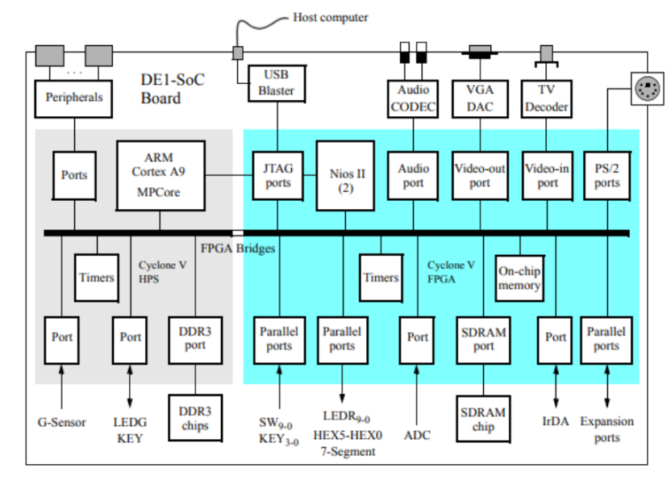
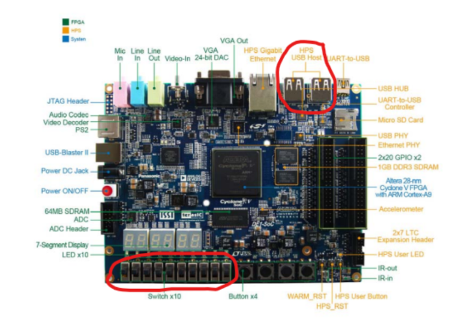
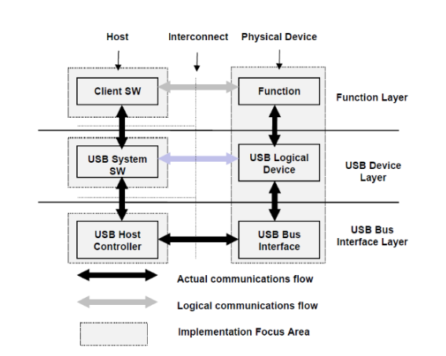
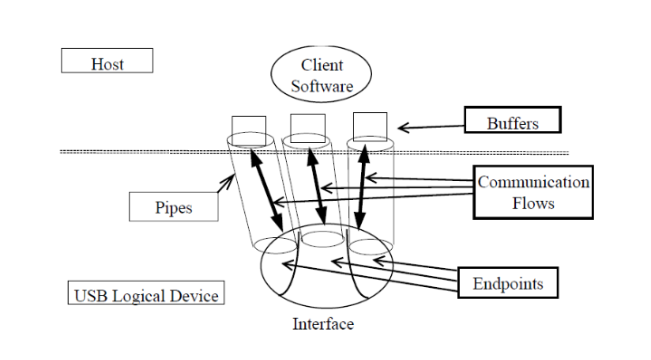
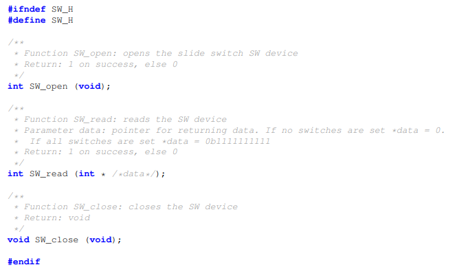

# Projeto de console dedicado em plataforma de desenvolvimento de hardware
## Introdução
Os jogos eletrônicos têm desempenhado um papel crucial na evolução da tecnologia e do entretenimento, proporcionando experiências interativas que transcendem os limites físicos. Mesmo em sua forma mais simples, como o jogo da velha, eles oferecem uma oportunidade fascinante para explorar conceitos de estratégia, competição e diversão.

O projeto visa a criação de um sistema de uma versão do jogo da velha, integrado com a locomoção dos quadrantes do tabuleiro a partir de um mouse. O projeto foi elaborado no kit de desenvolvimento De1-SoC, bem como seus periféricos inclusos.

- Os requisitos do projeto são:
	- Elaboração do código-fonte em C
	- Utilização dos dispositivos periféricos da placa para controle do jogo e opções associadas (como pausar e retornar  à partida)

## Descrição dos equipamentos e softwares utilizados:

- kit de desenvolvimento de1-soc:

O kit de desenvolvimento De1-SoC, da Altera University Program, é uma plataforma programável que combina uma FPGA System on Chip (SoC) da Altera com um processador dual-core Cortex A9 e os periféricos que envolvem a porção do Hard Processor System (HPS), sendo ideal para a prototipação de projetos que envolvam a integração entre software e hardware, dada a sua flexibilidade e seu alto desempenho. Devido a essa aplicabilidade, foi utilizado para o projeto.

* Nano
O GNU Nano trata-se de um editor de texto simples, incluso nativamente em sistemas operacionais Linux e que é executado no terminal de comandos do sistema operacional. Foi um dos softwares de edição de texto utilizados para a codificação do projeto.

* Replit
O Replit é um ambiente de desenvolvimento online que permite a edição de textos em conjunto com colegas de trabalho simultaneamente. Permite a codificação dos arquivos e a execução dos códigos no shell incluso na plataforma. Foi utilizado para criação e armazenamento de protótipos do projeto, auxiliando o trabalho em grupo.

* Linguagem C
A linguagem escolhida para a codificação do projeto foi C, devido a sua portabilidade para computadores que não possuam recursos tecnológicos avançados o suficiente para softwares mais pesados. Além disso, seu nível de abstração mais próximo da máquina e suas bibliotecas-padrão que auxiliam a interação com o sistema operacional, agem em conjunto para tornar mais prática a manipulação dos drivers dos dispositivos usados no sistema.

* Compilador GCC

	O GNU Compiler Collection (GCC) é um compilador de código aberto disponibilizado gratuitamente para várias linguagens de programação. Foi instalado e utilizado no sistema operacional do kit de desenvolvimento De1-SoC, para a compilação dos códigos C escritos pelo grupo.

- Arquitetura do ARM Cortex-A9 e relacionamento com componentes da placa:

O processador Cortex-A9 800MHz MPCore é projetado para implementações segundo a Instruction Set Architecture (ISA) ARMv7. Suporta multiprocessamento por ser dual-core.
Recebe majoritariamente instruções por palavras de comprimento de 32 bits.
	
A placa é composta pela porção FPGA, com o dispositivo Altera Cyclone® V SE 5CSEMA5F31C6N, e pela porção HPS, com o processador Cortex A9 e com memória RAM 1GB DDR3. Ambas porções também dispõem de diversos periféricos de entrada e saída de dados, cujo os utilizados serão futuramente explicitados nesse documento.

<strong>Componentes da De1-Soc. Os que estão no quadrante cinza pertencem ao HPS, e os azuis, ao FPGA. </strong>

  

<strong>Fonte: Manual do kit de desenvolvimento De1-SoC
</strong>

A comunicação dos componentes da FPGA com as instruções solicitadas pelo código C que são executadas no processador se dá pelas FPGA Bridges. O processador solicita ou envia dados para a FPGA por meio das pontes HPS-to-FPGA e lightweight HPS-to-FPGA (para dados de menor banda), realizando operações de leitura ou escrita ao consultar os elementos de memória da FPGA e, quando necessário, trazer os dados para a memória do HPS.

Os dispositivos de entrada e saída conectados à plataforma De1-SoC podem ser acessados na memória, por serem mapeados em diretórios específicos (explicados na seção dos drivers), sendo acessíveis perante a permissão concedida pelo sistema operacional Linux.

<strong>Dispositivos periféricos utilizados do kit de desenvolvimento De1-SoC</strong>

  

<strong>Fonte: manual do kit de desenvolvimento De1-SoC
</strong>

## Metodologia
- Criação do tabuleiro:
  Para criar o tabuleiro do jogo da velha, foi utilizada uma matriz de caracteres de tamanho 3x3, onde cada célula foi numerada de 1 a 9. Essa abordagem foi implementada para facilitar a visualização do jogador e ajudá-lo a identificar a localização das células.

Figura X representativa do tabuleiro do jogo da velha numerado.

Fonte:

- Verificar vencedor:
  Para determinar o vencedor, foi criada uma função que inspeciona o estado atual do tabuleiro e realiza três tipos de verificações: nas linhas, colunas e diagonais. Essa função examina todas as possibilidades de vitória e ao identificar uma sequência de 3 peças iguais em qualquer direção, declara que o jogo foi vencido. Abaixo pode-se ver como as verificações são feitas:
Verifica as linhas:

- Verifica as colunas:

- Verifica as diagonais:

- Delimitação do tabuleiro:

  Para garantir o funcionamento correto do tabuleiro, foi estabelecida uma delimitação de área em cada célula. Isso permite determinar, com base nos valores de coordenadas x e y, qual célula está sendo selecionada em determinado momento. Dessa forma as células possuem: 

# Área das células:
* Célula 1: x de 0 a 100, y de 0 a 100
* Célula 2: x de 101 a 200, y de 0 a 100
* Célula 3: x de 201 a 300, y de 0 a 100
* Célula 4: x de 0 a 100, y de 101 a 200
* Célula 5: x de 101 a 200, y de 101 a 200
* Célula 6: x de 201 a 300, y de 101 a 200
* Célula 7: x de 0 a 100, y de 201 a 300
* Célula 8: x de 101 a 200, y de 201 a 300
* Célula 9: x de 201 a 300, y de 201 a 300

- Abaixo é uma figura representativa dessa delimitação:

- Captura de dados do mouse:
  A captura dos dados dos eventos do mouse é realizada quando o programa abre o arquivo correspondente onde esses eventos são registrados. Esse arquivo é geralmente encontrado em `/dev/input/` e tem um nome como "eventX", onde X é um número que identifica o dispositivo específico. Uma vez que o arquivo é aberto usando a função `open()` do sistema, o programa recebe um descritor de arquivo que pode ser usado para ler os eventos.
Após a abertura do arquivo, ocorre uma leitura contínua dos dados do dispositivo para uma estrutura de eventos definida na biblioteca `linux/input.h`, chamada de `struct input_event`. Essa estrutura contém informações detalhadas sobre os eventos do mouse.
Com base nos dados contidos na estrutura `struct input_event`, o programa pode facilmente extrair informações relevantes, como o deslocamento do mouse nas coordenadas x e y.

- Dinâmica do jogo no código:
  O jogo começa com o primeiro jogador, representado pelo "X", e é controlado usando variáveis que capturam o deslocamento do mouse. Esse deslocamento é adicionado às variáveis relacionadas às coordenadas x e y. Essas coordenadas são restritas a valores entre 0 e 300 para garantir que não ultrapassem os limites do tabuleiro, conforme visto na seção de Delimitação do tabuleiro.
Em seguida, uma série de verificações são realizadas. Primeiro, verifica-se se as coordenadas estão dentro dos limites do tabuleiro. Em seguida, as coordenadas x e y capturadas pelo movimento do mouse são convertidas na célula correspondente do tabuleiro.
A segunda parte das verificações ocorre quando há um evento de clique esquerdo do mouse. Nesse momento, verifica-se se a célula está vazia para que a peça do jogador possa ser colocada. Se a célula já estiver ocupada, a peça do jogador não será inserida. No entanto, se a célula estiver vazia, ela será preenchida com a peça do jogador atual. Após isso, é feita uma verificação para determinar se o jogador venceu o jogo. Se o jogador venceu, uma mensagem de parabéns é exibida para o vencedor; caso contrário, é a vez do próximo jogador.
Esse processo continua até que um jogador vença ou até que ocorram mais de 9 jogadas, momento em que o jogo termina. Se não houver vencedor, uma mensagem de empate é exibida.

## Conexão USB (Hardware/Software)

- Sobre a configuração de um dispositivo-host:
  Quando um dispositivo usb é conectado num host, esse host irá enviar ‘’setup requests’’ para o dispositivo, o dispositivo reporta os atributos deles, através de descritores, e o host, através do processo de ‘’bus enumeration’’ configura o dispositivo com base na leitura de seus descritores (pelo endpoint 0). No caso da passagem de dados do mouse para o host, são usados endpoints (parte física de um dispositivo que transmite dados) do tipo interrupt nas transações de dados. Esses Endpoints interrupts são monitorados periodicamente pelo host e foram escolhidos pois os dados são enviados regularmente, sendo o que melhor se encaixa no contexto mouse-host.

- Sobre o sistema geral do USB:
  Todo o processo de passagem dos dados USB pode ser divididos como mostrado a seguir, por camadas hardware-software:
  
  
<strong>Camadas da conexão USB. </strong>

  

<strong>Fonte: Universal Serial Bus Specification Revision 2.0
</strong>

A primeira camada, de baixo para cima, é a camada física propriamente dita, ela que provê a conexão entre o host e o dispositivo. A camada do meio(abrigaria uma API do Linux, USB core por exemplo), é a camada onde os softwares que lidam com o USB  ficam, ela que vai lidar com operações genéricas no usb, como ler/escolher as melhores configurações host/device.
A última camada, é a responsável pela função do dispositivo USB específico,se for um mouse, por exemplo, os cliques no dispositivo físico, seriam interpretados como dados pelo ‘’client software’’(que nesse contexto seria o driver do próprio mouse).

- O fluxo de comunicação é o seguinte:
  
  
<strong>Fluxo de dados USB. </strong>

  

<strong>Fonte: Universal Serial Bus Specification Revision 2.0
</strong>

  
  O ‘’software client’’ (driver do mouse) geralmente solicita que seja movido os dados entre o buffer no lado do host e os endpoints nos dispositivos (dá-se o nome de pipe a essa relação). O ‘’host controller’’(a placa DE1SOC+sistema operacional) é quem inicia essa troca e gera atividade para movimento de dados. De maneira mais específica, o processo ocorre assim: para ocorrer uma transação a nível de barramento é necessário que o driver do mouse consuma ou gere dados para uma função específica do dispositivo através de endpoints, para isso ele tem que fazer uma ligação com o sistema USB(USB core), gerando um “interrupt request”(IRP), que é quando o software gera um sinal para movimentar dados entre o software e um endpoint. Por sua vez, o USB core faz uma chamada para o ‘’host controller driver’’(uma abstração do host controller) que por fim transformará os dados do IRP em transações, que são as entregas dos dados para um endpoint, que o Host controller usará para criar uma atividade a nível de barramento. O processo pode ser feito de maneira reversa.

A imagem a seguir resume todos os conceitos já ditos até aqui:

### Funcionamento do Mouse:
O kit de desenvolvimento fornece interfaces host USB 2.0 de 2 portas usando o controlador SMSC USB3300 e 2 portas controlador de hub, por meio de uma dessas portas que será conectada ao mouse para atender a necessidade do projeto. A princípio é importante trazer à tona alguns conceitos que são fundamentais para melhor entendimento de como se dá esta conexão USB. A definição de interfaces Host será o elemento inicial abordado para entendimento.
Quando é feita a conexão de um mouse no computador, é necessário que exista um USB Host, que no caso seria o próprio computador, fornecendo energia e gerenciando a comunicação com o USB Client, que seria o mouse, ele possui um papel fundamental no processo de comunicação USB, como o controle e gerenciamento dos dispositivos conectados. Para que exista a conexão do dispositivo conectado ao USB existe um controlador USB que emite regularmente, um sinal de início de quadro (SOF - Start of Frame). Todos os dispositivos estão constantemente ligados a linha de comunicação. Quando o controlador envia a informação com o endereço correspondente ao do dispositivo conectado, este interpreta o pacote, analisa o tipo de sinal e, com base nessa análise, executa as ações apropriadas. Essa captação e análise de sinais está relacionada ao protocolo USB.
Uma parte essencial do protocolo USB é a definição dos padrões de transação de pacotes, adaptados para diferentes tipos de transferências. Isso assegura que a informação seja enviada de maneira precisa e confiável. Além disso, o protocolo gerencia o fluxo de dados para prevenir excessos ou insuficiências nos buffers, garantindo a eficiência do sistema. O protocolo USB possui uma abordagem na organização de bits e bytes. Os bits são transmitidos do menos ao mais significativo, e os campos de múltiplos bytes são interpretados e transferidos pelo barramento em ordem do bit menos significativo para o mais significativo. Isso é crucial para garantir que os dados sejam interpretados corretamente pelos dispositivos conectados.

- The USB Core no Linux:
Ao longo das atualizações do kernel, ocorreu a integração de um suporte para USB ao Linux, e esse suporte tem sido aprimorado continuamente desde então. Além de adaptar-se a cada nova geração de USB, o sistema recebe suporte para diversos controladores host e a inclusão de novos drivers para dispositivos periféricos. O Linux é capaz não apenas de ser executado em dispositivos USB, mas também nos hosts responsáveis pelo controle desses dispositivos.
             
Dentro do Linux, há um subsistema responsável por reconhecer e operar dispositivos conectados ao USB, conhecido como "The USB Core", que opera com uma API dedicada para facilitar o suporte a dispositivos USB e controladores de host. Gerindo a função de fornecer uma camada de abstração que isola as particularidades de hardware ou dispositivos específicos, estabelecendo um conjunto padronizado de estruturas de dados, macros e funções, para interagir com o sistema operacional, seria a mesma ideia de responsabilidade que um drive teria. O núcleo USB consiste em conjuntos de instruções que são compartilhadas entre todos os drivers de dispositivos USB e os drivers de controlador de host. Essas instruções são estruturadas em duas camadas distintas dentro da API: uma camada superior e uma camada inferior. Na figura X é possível observar como ocorre essa estruturação no sistema operacional.

- Subsistema de Entrada no Linux:
O subsistema de entrada do Linux consiste em um conjunto de drivers que desempenham um papel fundamental no suporte aos dispositivos de entrada, como teclados, mouses e outros periféricos. Esses drivers atuam como mediadores entre o hardware e o sistema operacional, convertendo os sinais gerados pelos dispositivos em eventos compreensíveis para o sistema. Por exemplo, quando um usuário pressiona uma tecla ou movimenta o mouse, esses drivers capturam essas ações e as transmitem para o núcleo do sistema operacional. Em seguida, esses eventos são processados pelos aplicativos para realizar as operações correspondentes. Essa camada de abstração é fundamental para garantir a compatibilidade e a funcionalidade de uma ampla variedade de dispositivos de entrada no ambiente Linux, proporcionando uma experiência de usuário coesa e eficiente. Por meio dos arquivos relacionados aos dispositivos periféricos conectados via USB o subsistema de entrada do linux fornece uma interpretação para as informações que são passadas por meio destes, na figura X é possível perceber como seria a lógica de simplificação que ocorre entre o espaço do usuário, que seria propriamente os códigos feitos, o kernel do linux e as informações que são lidas, aquelas enviadas por meio do hardware conectado.

- Driver no Mouse:
Simplificadamente um driver seria um software que diz ao sistema operacional e a outros softwares como se comunicar com um hardware. O que está sendo utilizado para captar as informações do mouse via USB no problema é o que se chama de subsistema de entrada, que é um conjunto de drivers que oferecem um suporte para os dispositivos de entrada no linux. Esse conjunto de drivers basicamente conversam com o hardware e fornecem eventos (pressionamentos de teclas, movimentos do mouse, através da entrada USB) para o módulo de entrada. Como as informações recebidas através do mouse são inúmeros valores codificados em binário o drive vai funcionar como o meio responsável por capturar esses dados e designar diferentes ações que podem ser associadas a eles, possibilitando uma integração mais simples entre o hardware que o USB está conectado e o sistema operacional utilizado. 
Como os drivers traduzem os sinais do mouse para comandos compreensíveis pelo sistema operacional.
Os dados passados pelo mouse estão todos representados em valores binários, onde o conjunto de dados serão constantemente enviados pelo mouse para o sistema operacional, estes dados são passados por meio de um arquivo relacionado ao periférico conectado, por exemplo, é possível visualizar o conjunto de informações pelo próprio terminal do linux, inclusive escolhendo em que formato os dados serão visualizados, na figura X é possível perceber o arquivo correspondente ao mouse no terminal em formato hexadecimal.
Os dados presentes nos arquivos de entrada do mouse desempenham um papel fundamental no sistema operacional, fornecendo informações para a interação entre o dispositivo e o computador. De acordo com a documentação do kernel e as definições em input.h, esses dados são estruturados em eventos, capturando cada movimento ou clique realizado. Cada evento é cuidadosamente organizado em uma estrutura específica, contendo detalhes como tempo, tipo, código e valor. Essa organização minuciosa permite que o sistema operacional interprete com precisão as ações do mouse, garantindo uma resposta rápida e eficiente às interações do usuário.

- Acesso aos dispositivos específicos no Linux:
No Linux, os dispositivos são arquivos no diretório /dev/ cada dispositivo está relacionado a um arquivo específico, quando se faz a conexão de um dispositivo um arquivo para o dispositivo é criado dinamicamente e pode ser acessado no diretório / dev/ isso é possível graças a um programa de espaço de usuário chamado udev, um gerenciador de dispositivos dinâmico para o kernel Linux. Sempre que um dispositivo é adicionado ou removido, o kernel comunica a mudança para o udev .Então, o udev escuta esses uevents do kernel. Para cada evento, systemd-udevd (o daemon udev ) executa instruções específicas definidas para lidar com cada dispositivo.

- Visualizando as camadas Sistemas USB e ‘’Client software:
  É possível visualizar a camada do Sistema USB + o ‘’Client software’’ com o seguinte comando linux: “udevadm info -a -p $(udevadm info -q path -n /dev/input/event0)”. Esse comando traça do driver de nível mais baixo (isso é, o host controller driver) até o ‘’client software’’ (‘’driver’s hid’’ e geração de eventos por eles). A saída são os dispositivos e os drivers por camadas, exemplo:

looking at parent device '/devices/soc/ffb40000.usb':
	KERNELS=="ffb40000.usb"
	SUBSYSTEMS=="platform"
	DRIVERS=="dwc2"
	ATTRS{driver_override}=="(null)"

  looking at parent device '/devices/soc':
	KERNELS=="soc"
	SUBSYSTEMS=="platform"
	DRIVERS==""
	ATTRS{driver_override}=="(null)"
 
- Que descreve o subsistema ‘’plataform’’ onde está o driver para o controlador. Como a saída é muito grande, foi proposto a descrição por texto de toda organização dos drivers:

Na última camada, tem os controladores USB, como eles são instâncias do Synopsys® DesignWare® Cores USB 2.0 Hi-Speed
On-The-Go (DWC_otg) controller, eles precisam do driver desse controlador, que é o dwc2, sendo a primeira parte do host controller driver. No próximo subsistema, isso é, o ‘’usb’’, o driver de mesmo nome (usb) é responsável por complementar o dwc2 como host controller driver. Esse mesmo driver também lida com as configurações e leituras de descritores(campos nos dispositivos que guardam informações sobre eles) e da própria memória da porta usb host, por exemplo. Ainda nesse subsistema ‘’usb’’, tem a primeira camada da classe HID de dispositivos, o driver ‘’usbhid’’ juntamente com o driver ‘’hid-generic’’ do subsistema ‘’hid’’ são responsáveis por traduzir os dados para o sistema operacional, além de gerar eventos que serão escrito em arquivos do subsistema input, que é o que usamos no projeto.

- Conexão do Mouse ao Kit de Desenvolvimento DE1-SoC:
Como o mouse é conectado ao Kit de Desenvolvimento DE1-SoC através de uma porta USB:
Para conectar um mouse ao Kit de Desenvolvimento DE1-SoC, é necessário utilizar uma porta USB disponível no kit. Por meio do cabo USB do mouse, ele é conectado diretamente a uma das portas USB disponíveis no DE1-SoC. Uma vez conectado, o mouse se torna um dispositivo de entrada que permite ao usuário interagir de forma intuitiva com o sistema em execução no kit. Essa conexão USB permite que o mouse transmita sinais de movimento e cliques para o sistema, possibilitando a navegação em interfaces gráficas, o controle de cursores e outras interações baseadas em mouse, facilitando assim o desenvolvimento e a utilização do sistema embarcado.
- Como o Kit de Desenvolvimento DE1-SoC reconhece e interage com o mouse conectado:
O Kit de Desenvolvimento DE1-SoC reconhece e interage com o mouse conectado por meio do controlador USB integrado ao sistema. Quando um mouse é conectado à porta USB do DE1-SoC, o controlador USB detecta o dispositivo e comunica essa detecção ao sistema operacional em execução no kit. O sistema operacional, por sua vez, reconhece o mouse como um dispositivo de entrada e configura os drivers necessários para interpretar os movimentos e cliques do mouse. Os dispositivos de entrada podem ser visualizados e lidos no ambiente Linux assim como os arquivos, o dispositivo de entrada aparece no diretório /dev/input. 

- Integração do Mouse ao Jogo da Velha:

O mouse será utilizado para realizar as principais funcionalidades do jogo da velha, deslocar-se pelo tabuleiro e selecionar, a partir do clique no botão, um quadrante de interesse do usuário.
O mouse possui uma relação de movimentos relativos, que referem-se a mudança e variação de posição ao longo dos eixos x e y (considerando um plano cartesiano R2), a lógica associada a esse deslocamento ao longo dos eixos baseia-se na mudança contínua de pontos (x,y) ao longo de um possível deslocamento do mouse. O envio dos dados referentes a essa movimentação relativa não se dá de forma imediata, ou seja, considerando o movimento completo ao longo dos eixos, mas sim de forma gradativa enviando aos poucos os dados numéricos relacionados a um deslocamento completo que é feito, é possível observar como funciona essa variação na visualização do terminal na figura X, logo abaixo.

Diante dessa situação a necessidade de juntar esses valores para evidenciar onde estava acontecendo o movimento do mouse é nítida, aproveitando-se dessa ocasião que foi pensada a solução para dividir e mapear cada espaço(quadrante) relacionado ao jogo da velha. Com isso foi utilizada uma lógica de somatório dos valores recebidos pelo mouse, que representam a variação do deslocamento pelos eixos x e y, e colocado um limite para cada mudança de quadrante, a escolha de valores para representar diretamente uma possível mudança reflete diretamente no quão grande deverá ser o deslocamento do mouse na superfície. Por exemplo, caso o valor escolhido para o deslocamento a direita, considerando o eixo x nesse caso, que pode ser a mudança de quadrante do 1 para o 2 for igual a 70, o somatório realizado a partir dos valores que são enviados pelo mouse deve resultar em 70 para que seja feita a mudança de quadrante, caso o valor passe de 70 o quadrante resultante será o 3, visto que os valores são limitados para cada mudança ao longo do tabuleiro.
- Como os cliques do mouse serão interpretados como confirmação de jogadas:
A biblioteca input.h no Linux é responsável por lidar com dispositivos de entrada, como teclados e mouses. Quando um clique do mouse é realizado, uma informação é gerada pelo hardware do mouse e enviado para o sistema operacional. Esse sinal foi então capturado pelo kernel do Linux, que utiliza drivers específicos para dispositivos de entrada para interpretar e processar os dados recebidos. A biblioteca input.h fornece uma interface de programação que permite acessar e manipular eventos de entrada, como cliques de mouse, através de funções e estruturas de dados definidas nela. Isso permite no Linux a captura e resposta aos cliques do mouse de forma adequada, como mover o cursor, clicar em botões ou realizar outras ações dependendo do contexto.

- Integração das chaves HH no sistema:

Foi utilizada no sistema uma chave HH do kit de desenvolvimento De1-SoC para que o usuário possa pausar o jogo. Para realizar a leitura dos valores digitados nas chaves HH pertencentes ao kit de desenvolvimento De1-SoC, foram utilizados recursos disponibilizados da placa para o sistema operacional. A biblioteca intelfpgaup oferece acesso aos drivers dos dispositivos nativos da placa, informando em conjunto arquivos de extensão “.h” com os cabeçalhos das suas funções disponibilizadas e documentadas. Para fazer a inclusão da biblioteca, se insere no início do código C a expressão “#include <intelfpgaup/XX.h>, substituindo os X’s pelo nome do driver a ser acessado. 
Para a leitura das chaves HH, foi incluído o driver “SW.h”. A biblioteca oferece funções de abertura, leitura e fechamento do arquivo relativo ao driver. A função de leitura retorna o número de bytes lidos e atribui ao ponteiro para int inserido como seu parâmetro um valor binário, que representa, do bit de menor ao de maior importância, as chaves HH da chave CH0 à CH9 (as 10 chaves HH da De1-SoC). Chaves HH em alto são representadas com o valor 1, e as baixas em 0.

<strong>Cabeçalho das funções do módulo SW da intelfpgaup</strong>

  

<strong>Fonte: Using Linux With ARM-A9</strong>

Para a atribuição das bibliotecas da intelfpgaup ao sistema, deve ser adicionada uma instrução ao comando de compilação presente no Makefile. Ao final do comando, é adicionada a cflag “-intelfpgaup” para que o linker do GCC anexe as bibliotecas solicitadas ao projeto.

## Resultados e demonstração dos testes

## Conclusão

## Referências
